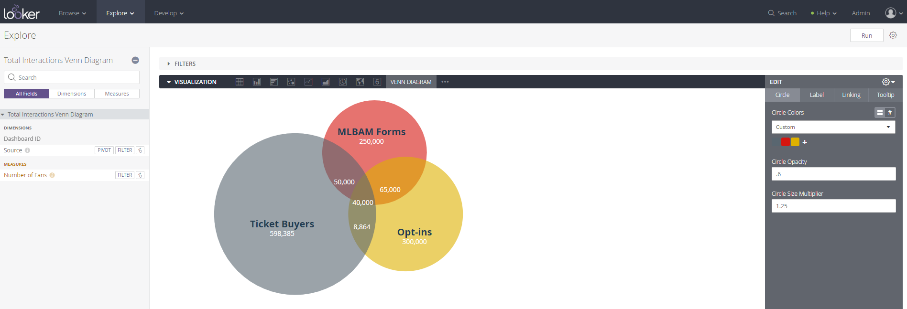
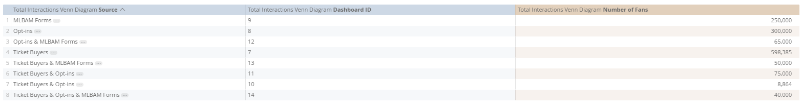

#  Venn Diagram

**How it works:**
1. Create a view containing the data set including overlapping dimensions and a measure. 
    1. For overlapping dimensions, separate values with the "&" character i.e. "Ticket Buyers & Opt-ins" 
    2. If you would like to incorporate dashboard linking, create a column for the dashboard id to be linked to
    3. The data set should look like the following (DO NOT include the "Linked Dashboard ID" column in your final explore, only in the view):
    
    
2. Create a new explore in Looker
3. Drag in the dimension column along with one measure column
4. Run the explore and choose "Venn Diagram" as the visualization type
5. Configure any options in the edit pane on the right
